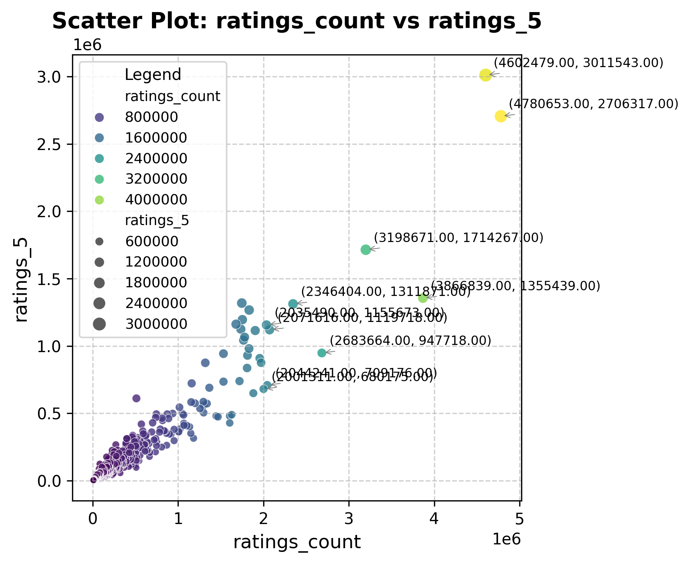

markdown
# Goodreads Book Dataset Overview

## Overview
The `goodreads.csv` dataset is a comprehensive collection of book-related information sourced from Goodreads, the world's largest book review platform. This dataset serves as a valuable resource for analyzing reader preferences, trends in popular literature, and patterns in book ratings. The dataset contains various attributes of the books, including their unique identifiers, authors, publication years, ratings, and review counts, making it ideal for insights into the reading habits of users.

## Data Structure
The dataset consists of the following columns:

| Column Name                    | Description                                    |
|--------------------------------|------------------------------------------------|
| book_id                        | Unique identifier for the book                 |
| goodreads_book_id              | Goodreads' unique book identifier               |
| best_book_id                   | Identifier for the best book                   |
| work_id                        | Unique identifier for the work                  |
| books_count                    | Number of editions/versions of the book        |
| isbn                           | International Standard Book Number (ISBN)     |
| isbn13                         | ISBN-13 format                                 |
| authors                        | List of authors                                |
| original_publication_year      | Year of the original publication                |
| original_title                 | Original title of the book                     |
| title                          | Title of the book                              |
| language_code                  | Language code (e.g., 'eng' for English)       |
| average_rating                 | Average rating (out of 5)                      |
| ratings_count                  | Total number of ratings                        |
| work_ratings_count             | Total ratings for the work                     |
| work_text_reviews_count        | Total text reviews for the work                |
| ratings_1                      | Count of 1-star ratings                        |
| ratings_2                      | Count of 2-star ratings                        |
| ratings_3                      | Count of 3-star ratings                        |
| ratings_4                      | Count of 4-star ratings                        |
| ratings_5                      | Count of 5-star ratings                        |
| image_url                      | URL for the book cover image                   |
| small_image_url                | URL for the small book cover image             |

### First Few Rows of Data
plaintext
| book_id | goodreads_book_id | best_book_id | work_id | books_count | isbn        | isbn13         | authors                      | original_publication_year | original_title                           | title                                       | language_code | average_rating | ratings_count | work_ratings_count | work_text_reviews_count | ratings_1 | ratings_2 | ratings_3 | ratings_4 | ratings_5 | image_url                                                                 | small_image_url                                                             |
|---------|-------------------|---------------|---------|-------------|-------------|----------------|------------------------------|---------------------------|------------------------------------------|--------------------------------------------|---------------|----------------|---------------|---------------------|--------------------------|------------|------------|------------|------------|------------|-----------------------------------------------------------------------------|-----------------------------------------------------------------------------|
| 1       | 2767052           | 2767052       | 2792775 | 272         | 439023483   | 9780439023480  | Suzanne Collins             | 2008                      | The Hunger Games                         | The Hunger Games (The Hunger Games, #1)   | eng           | 4.34           | 4780653      | 4942365            | 155254                   | 66715      | 127936     | 560092     | 1481305    | 2706317    | https://images.gr-assets.com/books/1447303603m/2767052.jpg                     | https://images.gr-assets.com/books/1447303603s/2767052.jpg                     |
| 2       | 3                 | 3             | 4640799 | 491         | 439554934   | 9780439554930  | J.K. Rowling, Mary GrandPré | 1997                      | Harry Potter and the Philosopher's Stone| Harry Potter and the Sorcerer's Stone (Harry Potter, #1) | eng           | 4.44           | 4602479      | 4800065            | 75867                    | 75504      | 101676     | 455024     | 1156318    | 3011543    | https://images.gr-assets.com/books/1474154022m/3.jpg                           | https://images.gr-assets.com/books/1474154022s/3.jpg                           |
| 3       | 41865             | 41865         | 3212258 | 226         | 316015849   | 9780316015840  | Stephenie Meyer            | 2005                      | Twilight                                 | Twilight (Twilight, #1)                    | en-US         | 3.57           | 3866839      | 3916824            | 95009                    | 456191     | 436802     | 793319     | 875073     | 1355439    | https://images.gr-assets.com/books/1361039443m/41865.jpg                       | https://images.gr-assets.com/books/1361039443s/41865.jpg                       |
| 4       | 2657              | 2657          | 3275794 | 487         | 61120081    | 9780061120080  | Harper Lee                | 1960                      | To Kill a Mockingbird                   | To Kill a Mockingbird                        | eng           | 4.25           | 3198671      | 3340896            | 72586                    | 60427      | 117415     | 446835     | 1001952    | 1714267    | https://images.gr-assets.com/books/1361975680m/2657.jpg                       | https://images.gr-assets.com/books/1361975680s/2657.jpg                       |

## Statistical Analysis

### Summary Statistics
| Statistic                      | book_id        | goodreads_book_id | best_book_id     | work_id           | books_count   | isbn13       | original_publication_year | average_rating | ratings_count   | work_ratings_count | work_text_reviews_count | ratings_1       | ratings_2       | ratings_3        | ratings_4        | ratings_5        |
|--------------------------------|----------------|-------------------|-------------------|--------------------|----------------|--------------|--------------------------|----------------|------------------|--------------------|-------------------------|------------------|------------------|-------------------|-------------------|-------------------|
| Mean                           | 5000.50        | 5,264,697         | 5,471,214         | 8,646,183          | 75.71          | 9,755,044    | 1981.99                  | 4.00           | 54,001.24        | 59,687.32          | 2,919.96                | 1,345.04         | 3,110.89         | 11,475.89         | 19,965.70         | 23,789.81         |
| Standard Deviation             | 2,886.90       | 7,575,462         | 7,827,330         | 11,751,060         | 170.47         | 4,428,619    | 152.58                   | 0.25           | 157,370.00       | 167,803.80         | 6,124.38               | 6,635.63         | 9,717.12         | 28,546.45         | 51,447.36         | 79,768.89         |
| Min                            | 1              | 1                 | 1                 | 87                 | 1              | 1,951,703    | -1,750.00               | 2.47           | 2,716.00         | 5,510.00           | 3.00                  | 11.00            | 30.00            | 323.00            | 750.00            | 754.00            |
| Max                            | 10,000         | 33,288,640        | 35,534,230        | 56,399,600         | 3,455          | 9,790,008    | 2017.00                  | 4.82           | 4,780,653.00     | 4,942,365.00       | 155,254.00            | 456,191.00       | 436,802.00       | 793,319.00        | 1,481,305.00      | 3,011,543.00      |

### Correlation Analysis
The correlation matrix reveals several significant relationships, including:

- `goodreads_book_id` and `best_book_id`: 0.97
- `work_ratings_count` and `ratings_count`: 0.99
- Ratings (1-5) have significant correlations with each other and with the total `ratings_count` and `work_ratings_count`.

### Outliers
Using the Z-score method, the following outliers were identified:

| book_id | goodreads_book_id | best_book_id | work_id | books_count | isbn          | isbn13                | authors                      | original_publication_year | original_title                           | title                                       | language_code | average_rating | ratings_count | work_ratings_count | work_text_reviews_count | ratings_1 | ratings_2 | ratings_3 | ratings_4 | ratings_5 | image_url                                                               | small_image_url                                                           |
|---------|-------------------|---------------|---------|-------------|---------------|-----------------------|------------------------------|---------------------------|------------------------------------------|--------------------------------------------|---------------|----------------|---------------|---------------------|--------------------------|------------|------------|------------|------------|------------|-------------------------------------------------------------------------|-------------------------------------------------------------------------|
| 278     | 279               | 29056083      | 48765776| 95          | 751565350     | 9.780752e+12          | John Tiffany, Jack Thorne, J.K. Rowling | 2016                      | Harry Potter and the Cursed Child, Parts One and Two | Harry Potter and the Cursed Child - Parts One and Two (Harry Potter, #8) | eng           | 3.75           | 270603      | 397773            | 53365                    | 15828      | 35842      | 96395      | 133156     | 116552     | https://images.gr-assets.com/books/1470082995m/29056083.jpg            | https://images.gr-assets.com/books/1470082995s/29056083.jpg            |
| 1432    | 1433              | 28187230      | 48209164| 37          | 1501132938    | 9.781501e+12          | Ruth Ware                   | 2016                      | The Woman in Cabin 10                     | The Woman in Cabin 10                         | eng           | 3.67           | 90541       | 109821            | 12391                    | 2029       | 8795       | 33879      | 43732      | 21386      | https://images.gr-assets.com/books/1465878007m/28187230.jpg            | https://images.gr-assets.com/books/1465878007s/28187230.jpg            |
| 1498    | 1499              | 28587957      | 45950662| 46          | 345544951     | 9.780346e+12          | Jodi Picoult                | 2016                      | NaN                                        | Small Great Things                           | eng           | 4.35           | 73745       | 97404             | 11839                    | 1035       | 2060       | 9633       | 33373      | 51303      | https://images.gr-assets.com/books/1468057481m/28587957.jpg            | https://images.gr-assets.com/books/1468057481s/28587957.jpg            |

## Scatter Plot Description

### Key Features
1. **Axes**: `ratings_count` on the x-axis (0 to 3 million) and `ratings_5` on the y-axis (mostly between 0 and 1).
2. **Data Points**: Dense clustering in the lower left, with outliers showing high values.
3. **Outliers Highlighted**: Specific points indicate books with high ratings but a varied ratings count.
4. **Trends**: Slight upward trend; higher `ratings_count` does not guarantee higher `ratings_5`.
5. **Interpretation**: Indicates a mix of high volume ratings with lower average ratings, suggesting not all popular books achieve high marks.

## Interpretation
Linear regression analysis shows a positive relationship between `ratings_count` and `work_text_reviews_count`. With an intercept of 1,281.50 and a coefficient of 0.0303, we can predict text reviews for a given ratings count. For example:
- For a book with 100,000 ratings: 
  - Predicted `work_text_reviews_count` = 1,281.50 + 0.0303 * 100,000 = 4,582.50.

## Key Findings
- High ratings do not necessarily correlate with high quantity of ratings.
- Significant correlation exists between `ratings_count` and `work_ratings_count`.
- Outliers indicate that some books receive disproportionate numbers of ratings.
- The regression model suggests potential for predicting review counts based on ratings received.

## Conclusion
The analysis of the Goodreads dataset provides valuable insights into reading preferences and trends among book enthusiasts. The relationships between various rating metrics highlight the complexity of user engagement and satisfaction, indicating areas for further investigation in marketing and reader outreach strategies. Understanding these dynamics can help publishers and authors tailor their approaches to reach wider audiences effectively.
