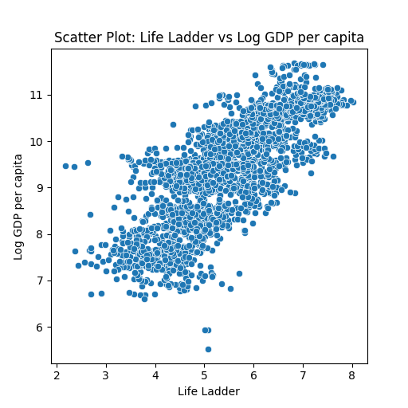

markdown
# Happiness Dataset Summary

## Overview
The dataset `happiness.csv` encompasses data that measures different aspects of happiness and well-being across various countries from 2005 to 2023. By analyzing factors such as GDP per capita, social support, and freedom to make life choices, this dataset aims to uncover the relationships between economic indicators and subjective measures of happiness. 

## Data Structure
The dataset consists of the following columns:

| Column Name                              | Description                                               |
|------------------------------------------|-----------------------------------------------------------|
| Country name                             | The name of the country                                   |
| year                                     | The year of the recorded data                             |
| Life Ladder                              | A score representing perceived life satisfaction          |
| Log GDP per capita                       | The logarithm of the GDP per capita                       |
| Social support                           | Measure of perceived social support                        |
| Healthy life expectancy at birth         | Average life expectancy at birth                           |
| Freedom to make life choices             | Measure of the freedom in making choices                  |
| Generosity                               | Measure of perceived generosity                            |
| Perceptions of corruption                 | Measure of the degree of corruption perceived              |
| Positive affect                          | Measure of the frequency of positive emotions             |
| Negative affect                          | Measure of the frequency of negative emotions             |

### First Few Rows of Data
| Country Name  | Year | Life Ladder | Log GDP per capita | Social support | Healthy life expectancy at birth | Freedom to make life choices | Generosity | Perceptions of corruption | Positive affect | Negative affect |
|---------------|------|-------------|---------------------|----------------|----------------------------------|------------------------------|------------|---------------------------|-----------------|-----------------|
| Afghanistan   | 2008 | 3.724       | 7.35                | 0.451          | 50.5                             | 0.718                        | 0.164      | 0.882                     | 0.414           | 0.258           |
| Afghanistan   | 2009 | 4.402       | 7.509               | 0.552          | 50.8                             | 0.679                        | 0.187      | 0.85                      | 0.481           | 0.237           |
| Afghanistan   | 2010 | 4.758       | 7.614               | 0.539          | 51.1                             | 0.600                        | 0.118      | 0.707                     | 0.517           | 0.275           |
| Afghanistan   | 2011 | 3.832       | 7.581               | 0.521          | 51.4                             | 0.496                        | 0.160      | 0.731                     | 0.480           | 0.267           |

## Statistical Analysis
### Summary Statistics
The following summary statistics provide insights into the dataset:

| Statistic | Year       | Life Ladder | Log GDP per capita | Social support | Healthy life expectancy at birth | Freedom to make life choices | Generosity | Perceptions of corruption | Positive affect | Negative affect |
|-----------|------------|-------------|---------------------|----------------|----------------------------------|------------------------------|------------|---------------------------|-----------------|-----------------|
| Mean      | 2014.76    | 5.48        | 9.40                | 0.81           | 63.40                            | 0.75                        | 0.00       | 0.74                    | 0.65            | 0.27            |
| Std Dev   | 5.05       | 1.13        | 1.15                | 0.12           | 6.84                             | 0.14                        | 0.16       | 0.18                    | 0.11            | 0.09            |
| Min       | 2005       | 1.28        | 5.53                | 0.23           | 6.72                             | 0.23                        | -0.34      | 0.035                   | 0.18            | 0.08            |
| Max       | 2023       | 8.02        | 11.68               | 0.99           | 74.60                            | 0.99                        | 0.70       | 0.98                    | 0.88            | 0.71            |

### Correlation Analysis
Significant correlations detected:

| Variable                                  | Correlation Coefficient |
|-------------------------------------------|-------------------------|
| Life Ladder - Log GDP per capita         | 0.78                    |
| Life Ladder - Social support              | 0.72                    |
| Life Ladder - Healthy life expectancy     | 0.71                    |
| Life Ladder - Freedom to make life choices| 0.54                    |
| Life Ladder - Positive affect             | 0.52                    |

## Outliers
Using the Z-score method, the following outliers were detected:

| Country Name  | Year | Life Ladder | Log GDP per capita | Social support | Healthy life expectancy at birth | Freedom to make life choices | Generosity | Perceptions of corruption | Positive affect | Negative affect |
|---------------|------|-------------|---------------------|----------------|----------------------------------|------------------------------|------------|---------------------------|-----------------|-----------------|
| Afghanistan   | 2022 | 1.281       | NaN                 | 0.228          | 54.875                           | 0.368                        | NaN        | 0.733                     | 0.206           | 0.576           |
| Afghanistan   | 2023 | 1.446       | NaN                 | 0.368          | 55.200                           | 0.228                        | NaN        | 0.738                     | 0.261           | 0.460           |
| Venezuela     | 2017 | 5.071       | 5.943               | 0.896          | 64.750                           | 0.636                        | 0.050      | 0.844                     | 0.697           | 0.363           |
| Venezuela     | 2018 | 5.006       | 5.935               | 0.887          | 64.575                           | 0.611                        | 0.068      | 0.828                     | 0.723           | 0.374           |
| Venezuela     | 2019 | 5.081       | 5.527               | 0.888          | 64.400                           | 0.626                        | 0.124      | 0.839                     | 0.730           | 0.351           |

## Scatter Plot Description
### Scatter Plot of Life Ladder vs. Log GDP per Capita

The scatter plot illustrates the relationship between the Life Ladder (a measure of happiness) and Log GDP per capita. There is a noticeable positive trend, indicating that as GDP per capita increases, so does the perceived life satisfaction (Life Ladder). However, there are a few anomalies where countries with lower GDP continue to report higher happiness levels, suggesting other factors may influence life satisfaction.

## Interpretation
### Linear Regression Summary for Healthy Life Expectancy at Birth -> Life Ladder
| Metric                   | Value   |
|-------------------------|---------|
| Intercept               | -2.0315 |
| Coefficient             | 0.1185  |
| Mean Squared Error (MSE)| 0.6288  |
| R² Score                | 0.5111  |

This regression analysis indicates that there is a moderate fit for the model. The positive relationship signifies that as Healthy life expectancy increases, the Life Ladder tends to rise as well, affirming the importance of health in determining happiness.

## Implications
The analysis reveals critical links between economic indicators and perceived happiness, shedding light on areas for potential intervention. Notable areas for further investigation include:
- Exploring the role of social support and freedom in enhancing happiness.
- Investigating outliers to understand unconventional trends in happiness despite economic challenges.

## Key Findings
- A strong correlation exists between economic factors and happiness, specifically between GDP per capita and Life Ladder.
- Outliers suggest that social and health factors might mitigate the impact of GDP on happiness.
- The regression analysis indicates a positive relationship between healthy life expectancy and life satisfaction.

## Conclusion
The dataset provides valuable insights into the factors influencing happiness globally. The findings emphasize the importance of a multi-faceted approach to improving overall life satisfaction, beyond merely boosting economic output. Future research could delve deeper into social and health policies that enhance well-being across diverse populations.
