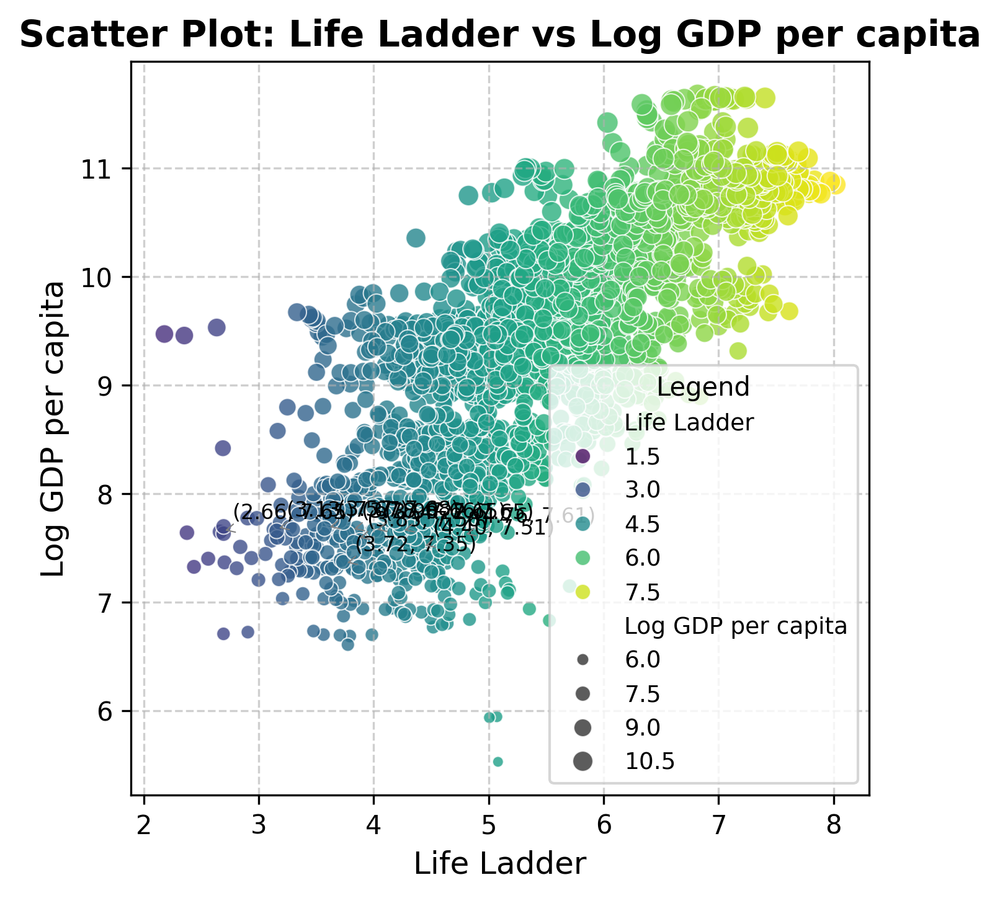

# Happiness Dataset Summary

## Overview
The `happiness.csv` dataset encompasses various indicators that reflect the subjective and objective facets of well-being across different countries. It primarily aims to facilitate comparisons of life satisfaction and quality of life against economic and social variables. This dataset is particularly relevant for researchers, policymakers, and economists interested in global happiness trends and their determinants.

## Data Structure
The dataset contains the following columns:
- **Country name**: The name of the country.
- **year**: The year of observation.
- **Life Ladder**: A measure of well-being or life satisfaction on a scale from 0 to 10.
- **Log GDP per capita**: Logarithmic transformation of GDP per capita, a common way to normalize financial data.
- **Social support**: A measure of perceived social support.
- **Healthy life expectancy at birth**: The average years a newborn is expected to live in good health.
- **Freedom to make life choices**: A metric assessing the perceived freedom individuals have in life decisions.
- **Generosity**: A metric representing the willingness to give.
- **Perceptions of corruption**: A measure that indicates the level of perceived corruption in the country.
- **Positive affect**: The presence of positive emotions in people's lives.
- **Negative affect**: The prevalence of negative emotions in people's lives.

### First Few Rows of Data
plaintext
| Country name | year | Life Ladder | Log GDP per capita | Social support | Healthy life expectancy at birth | Freedom to make life choices | Generosity | Perceptions of corruption | Positive affect | Negative affect |
|--------------|------|-------------|---------------------|----------------|-----------------------------------|------------------------------|------------|---------------------------|-----------------|-----------------|
| Afghanistan  | 2008 | 3.724       | 7.35                | 0.451          | 50.5                              | 0.718                        | 0.164      | 0.882                     | 0.414           | 0.258           |
| Afghanistan  | 2009 | 4.402       | 7.509               | 0.552          | 50.8                              | 0.679                        | 0.187      | 0.850                     | 0.481           | 0.237           |
| Afghanistan  | 2010 | 4.758       | 7.614               | 0.539          | 51.1                              | 0.600                        | 0.118      | 0.707                     | 0.517           | 0.275           |
| Afghanistan  | 2011 | 3.832       | 7.581               | 0.521          | 51.4                              | 0.496                        | 0.160      | 0.731                     | 0.480           | 0.267           |

## Statistical Analysis

### Summary Statistics
plaintext
|             | year      | Life Ladder | Log GDP per capita | Social support | Healthy life expectancy at birth | Freedom to make life choices | Generosity | Perceptions of corruption | Positive affect | Negative affect |
|-------------|-----------|-------------|---------------------|----------------|-----------------------------------|------------------------------|------------|---------------------------|-----------------|-----------------|
| mean        | 2014.76   | 5.48        | 9.40                | 0.81           | 63.40                             | 0.75                         | 0.00       | 0.74                      | 0.65            | 0.27            |
| std         | 5.06      | 1.13        | 1.15                | 0.12           | 6.84                              | 0.14                         | 0.16       | 0.18                      | 0.11            | 0.09            |
| min         | 2005.00   | 1.28        | 5.53                | 0.23           | 6.72                              | 0.23                         | -0.34      | 0.04                      | 0.18            | 0.08            |
| max         | 2023.00   | 8.02        | 11.68               | 0.99           | 74.60                             | 0.99                         | 0.70       | 0.98                      | 0.88            | 0.71            |

### Correlation Analysis
The correlation matrix highlights significant relationships among variables:
- **Life Ladder & Log GDP per capita**: 0.78
- **Social support & Life Ladder**: 0.72
- **Healthy life expectancy at birth & Log GDP per capita**: 0.82

These strong correlations indicate that higher economic performance correlates with both higher subjective well-being and healthier populations.

## Outliers
The following outliers were detected using the Z-score method:
plaintext
| Country name | year | Life Ladder | Log GDP per capita | Social support | Healthy life expectancy at birth | Freedom to make life choices | Generosity | Perceptions of corruption | Positive affect | Negative affect |
|--------------|------|-------------|---------------------|----------------|-----------------------------------|------------------------------|------------|---------------------------|-----------------|-----------------|
| Afghanistan  | 2022 | 1.281       | NaN                 | 0.228          | 54.875                            | 0.368                        | NaN        | 0.733                     | 0.206           | 0.576           |
| Afghanistan  | 2023 | 1.446       | NaN                 | 0.368          | 55.200                            | 0.228                        | NaN        | 0.738                     | 0.261           | 0.460           |
| Venezuela     | 2017 | 5.071       | 5.943               | 0.896          | 64.750                            | 0.636                        | 0.050      | 0.844                     | 0.697           | 0.363           |

## Scatter Plot Description

### Axes
- **X-axis**: Life Ladder (1.5 to 9.0)
- **Y-axis**: Log GDP per Capita (1.5 to 10.5)

### Data Points
- The scatter plot displays circular markers indicating data points of countries, with a gradient from dark purple for lower Life Ladder values to bright yellow for higher values.

### Patterns and Trends
- **Positive Correlation**: The upward trend implies that as Life Ladder increases, Log GDP per capita also rises, indicating that higher economic wealth contributes to better life satisfaction.
- **Outlier Distribution**: A few countries showcase high GDP but lower Life Ladder values, reflecting nuances between economic performance and perceived happiness.

## Interpretation
### Linear Regression Summary for Healthy life expectancy at birth -> Log GDP per capita
plaintext
Predictor (Independent Variable): Healthy life expectancy at birth
Target (Dependent Variable): Log GDP per capita
Intercept: 0.6238
Coefficient: 0.1383
Mean Squared Error (MSE): 0.4375
R² Score: 0.6713

- The R² score of 0.6713 suggests a moderate fit for the model. It indicates a positive relationship, where increases in life expectancy correlate with an increase in GDP.

## Implications
- The dataset underscores the importance of economic and social factors in promoting overall happiness and well-being.
- Insights could guide policymakers in resource allocation to enhance social support systems and improve life expectancy, which may further contribute to greater happiness and economic prosperity.

## Key Findings
- The dataset reveals strong correlations between economic indicators and subjective well-being.
- Afghanistan exhibits consistent lower well-being scores compared to other nations, highlighting potential areas for intervention.
- The linear regression indicates that as healthy life expectancy increases, so does economic wealth.

## Conclusion
This analysis of the `happiness.csv` dataset emphasizes significant relationships among well-being indicators and economic prosperity. The findings can inform global initiatives to improve quality of life, suggesting that enhancing social support systems and public health can lead to greater life satisfaction. The results also advocate for targeted research and policies aimed at countries with lower happiness scores. 

--- 

*Please ensure to add the "scatter_plot.png" image file in your project structure for the visual to render properly.*