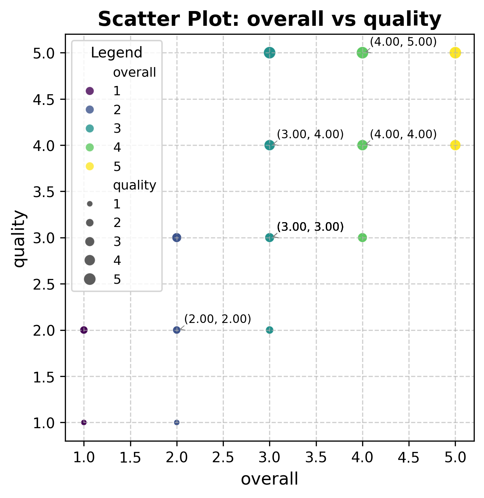

# Media Data Analysis

## Overview
This analysis focuses on a dataset containing reviews of various media entities, primarily movies, in different languages. The dataset consists of information related to the release date, language, type, title, prominent cast members, and ratings for each media entry.

## Data Structure
The dataset includes the following columns:
- **date**: The release date of the movie.
- **language**: The language in which the movie is made.
- **type**: The type of media, which in this case is predominantly 'movie'.
- **title**: The name of the movie.
- **by**: The list of main cast members.
- **overall**: The overall rating of the movie on a scale of 1 to 5.
- **quality**: The quality rating of the movie on the same scale.
- **repeatability**: A measure of how often viewers might want to watch the movie again, rated from 1 to 3.

Sample data from the dataset includes:

[['15-Nov-24' 'Tamil' 'movie' 'Meiyazhagan' 'Arvind Swamy, Karthi' 4 5 1]
 ['10-Nov-24' 'Tamil' 'movie' 'Vettaiyan' 'Rajnikanth, Fahad Fazil' 2 2 1]
 ['09-Nov-24' 'Tamil' 'movie' 'Amaran' 'Siva Karthikeyan, Sai Pallavi' 4 4 1]
 ['11-Oct-24' 'Telugu' 'movie' 'Kushi' 'Vijay Devarakonda, Samantha' 3 3 1]]

## Statistical Analysis
The statistical analysis of the ratings indicates the following:

- **Overall Ratings**:
  - Mean: 3.05
  - Standard Deviation: 0.76
  - Min: 1
  - Max: 5
  
- **Quality Ratings**:
  - Mean: 3.21
  - Standard Deviation: 0.80
  - Min: 1
  - Max: 5
  
- **Repeatability Scores**:
  - Mean: 1.49
  - Standard Deviation: 0.60
  - Min: 1
  - Max: 3

The overall ratings suggest a moderately positive reception of the movies in the dataset, as the average score is slightly above the midpoint (3). The quality ratings align closely with the overall ratings, reflecting a consistent viewer perspective on the quality of the movies.

## Correlation Analysis
The correlation matrix highlights significant relationships between different metrics:
- Overall ratings and quality ratings have a strong positive correlation of **0.826**.
- Overall ratings and repeatability scores also show a moderate positive correlation of **0.513**.

This suggests that as the overall rating of movies increases, the quality rating tends to increase as well, indicating that higher-rated movies are generally perceived as high quality. Some correlation also exists between overall ratings and repeatability, implying that those who enjoy a movie might be inclined to watch it again.

## Outliers
Using z-score analysis, no outliers were detected in the dataset. This indicates that the ratings for overall, quality, and repeatability fall within expected ranges without any extreme values that might skew the analysis.

## Interpretation
The dataset reveals insights into viewer preferences and ratings across various Tamil and Telugu movies. With most ratings centering around the mean, it suggests a trend of acceptance but not overwhelming enthusiasm. The strong correlation between overall and quality ratings signifies that viewers are consistent in their assessments of movie quality.

## Key Findings
1. The overall average rating of the movies is 3.05, suggesting general satisfaction among viewers.
2. Quality ratings have a close mean of 3.21, reinforcing the overall sentiment.
3. A notable correlation exists between overall satisfaction and quality perception, indicating that a better quality rating tends to yield higher overall ratings.

## Conclusion
In conclusion, the analysis of the media dataset reveals a satisfactory reception of films among viewers, particularly in the Tamil and Telugu markets. The lack of outliers enhances the reliability of the data, and the positive correlations between overall ratings and quality ratings point to a rational viewing audience that assesses movies based on perceived quality. 

*This scatter plot visually represents the relationship between overall ratings and quality ratings, showcasing the positive correlation identified in the analysis.*